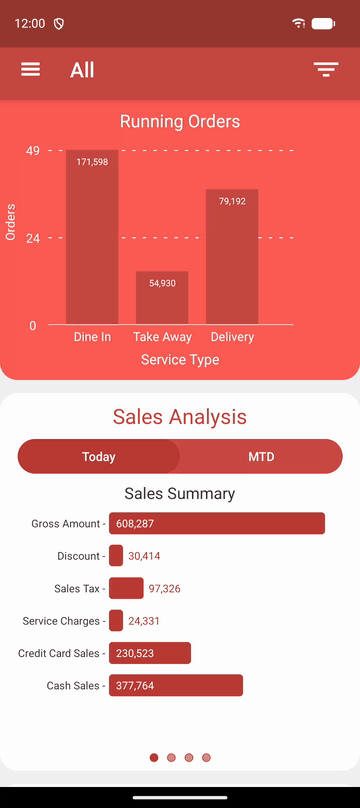
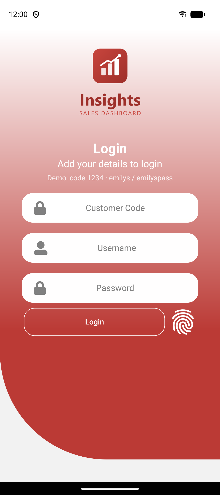
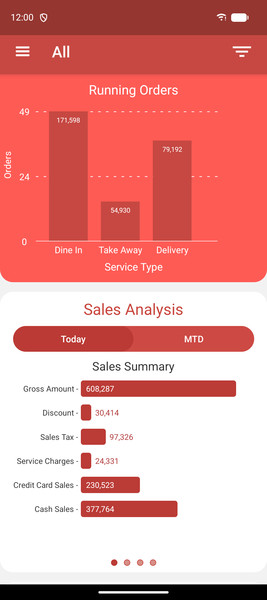
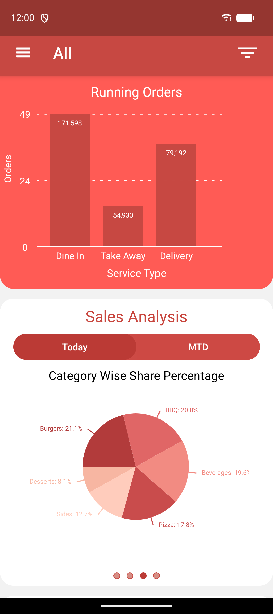
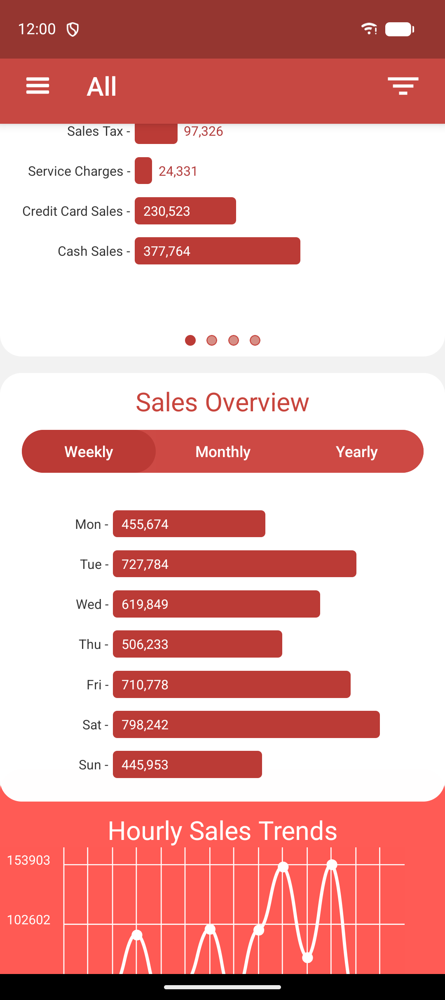
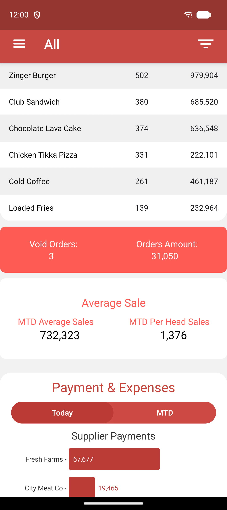

# Insights

Sales dashboard app for restaurant owners, built with React Native (Android).

I originally built this for a restaurant POS client so owners could check their sales from their phone. The real app talked to the client's backend, so for this public version I replaced it with mock data. The screens, charts and state management are the same as the original.

<p align="center">
  
</p>

## Features

- Login with customer code, username and password (plus fingerprint login using the device keychain)
- Running orders by service type (dine in, take away, delivery)
- Sales analysis for today and month-to-date: sales summary, service type sales, category share pie chart, dine-in covers
- Weekly, monthly and yearly sales overview
- Hourly sales trend
- Top 10 deals and items
- Void orders, average sale, supplier payments and petty expenses
- Filter everything by branch

## Screenshots

<table>
  <tr>
    <td></td>
    <td></td>
    <td></td>
    <td></td>
    <td></td>
  </tr>
</table>

## Built with

React Native 0.79, Redux Toolkit, React Navigation, Axios, React Native Paper, react-native-gifted-charts, react-native-chart-kit, react-native-keychain

## Running it

You need a working React Native Android setup ([guide](https://reactnative.dev/docs/set-up-your-environment)).

```sh
npm install
npm start
npm run android
```

To log in use customer code `1234`, username `emilys` and password `emilyspass`.

## Mock data

- Login goes through the free [DummyJSON](https://dummyjson.com/docs/auth) auth API.
- Everything else is static JSON in `mock-api/v1`, loaded straight from this repo through raw.githubusercontent.com. Each endpoint has one file per branch (`0` is all branches), e.g. `mock-api/v1/sales-summary/1.json`.
- `npm run mock-api:generate` regenerates the data and `npm run mock-api` serves it locally on port 3001. To use the local server, change `MOCK_API_BASE_URL` in `src/constants/endpoints.js` to `http://10.0.2.2:3001/v1/`.

Release signing values (`MYAPP_UPLOAD_*`) are read from `~/.gradle/gradle.properties` and are not in the repo.
